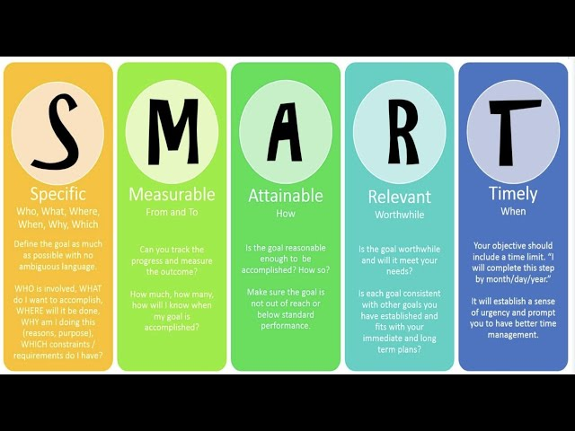

 
 
 
 
 
 
 

## Asking Questions

Questions come in all shapes and sizes, but it is important to ask meaningful questions that reflect exactly what you want answered. An example of a bad question is "Can you fix my code?", followed by a screenshot. Yes, it's doable, but why would you make someone analyze your picture, going over each line themselves, instead of making it as easy as possible for the person going out of their way to help you? You can try to narrow down the issues, ask for clarification on a specific syntax issue, or direct them to a single line of code. The more specificity, the easier it is for the person reading your question to answer thoughtfully and to answer your original question.

## Asking SMART Questions

While you might get away with asking vague questions to friends or using generative AI tools, it's not a good practice when reaching out to developers on Stack Overflow. Their time is valuable, so it's essential to be as detailed and clear as possible. Before posting, try to troubleshoot on your own and use Stack Overflow or other forums only as a last resort, particularly for questions that are too niche for automated tools to handle. If your question pertains to a human error in logic or a tricky syntax issue, it’s often best left to real developers. Recognize when your query could be resolved by reading official documentation, watching a tutorial, or experimenting on your own before asking someone else to dedicate their time.

## Closing Statement

If you are going to ask developers of forums like StackOverflow, be specific, do your research on the topic beforehand, and exhaust all other possible resources. It's also good to mention that there is no guarantee that someone will get back to you promptly, so be cautious with the timeframe you need your question answered. By preparing thoughtful, well-researched questions, you increase your chances of receiving quality responses from the community.
