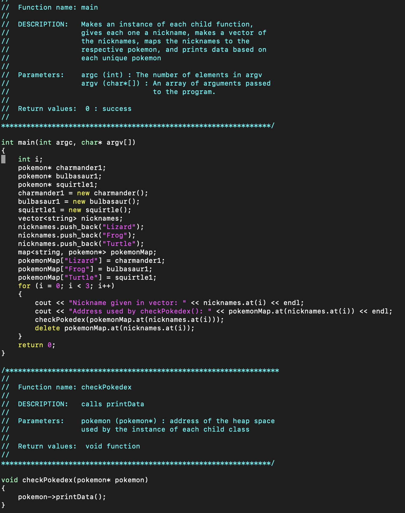
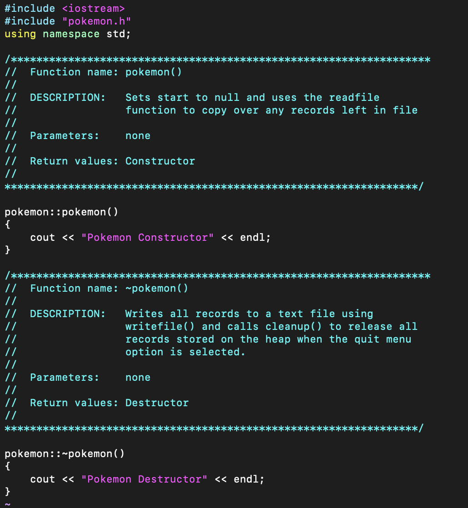

The "Pokedex" project is a simple C program I developed during my sophomore year as part of an ICS class assignment. It allows users to input various details about Pokémon, such as their names, nicknames, and weights, and later print this information to the console. The project served as an introduction to handling user input and managing data in C, offering a foundational understanding of basic programming concepts.

Although not particularly complex, this project was an important milestone in my coding journey. It helped me develop practical skills in programming logic, data management, and user interaction—essential building blocks for more advanced projects. Completing this assignment boosted my confidence and proficiency in C programming.

