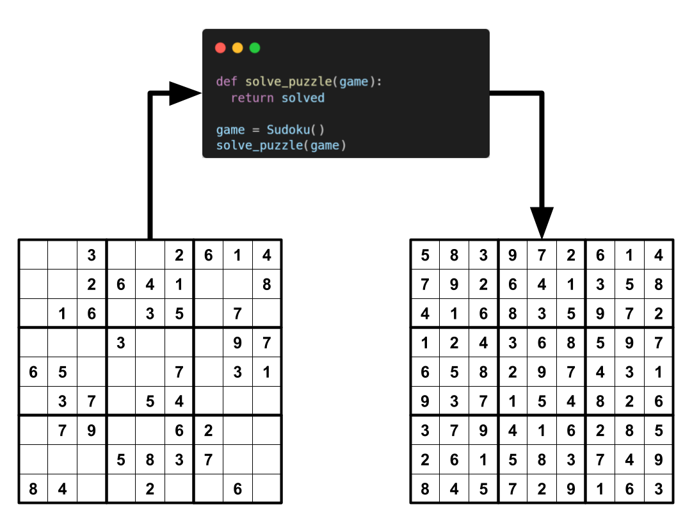
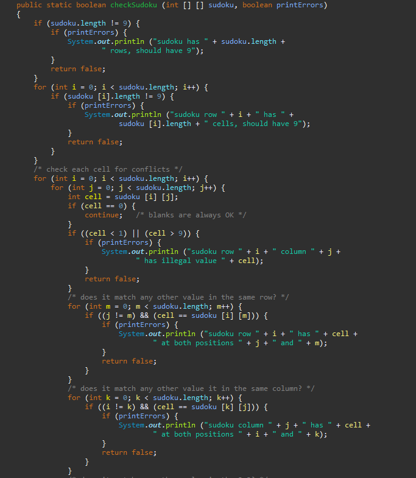
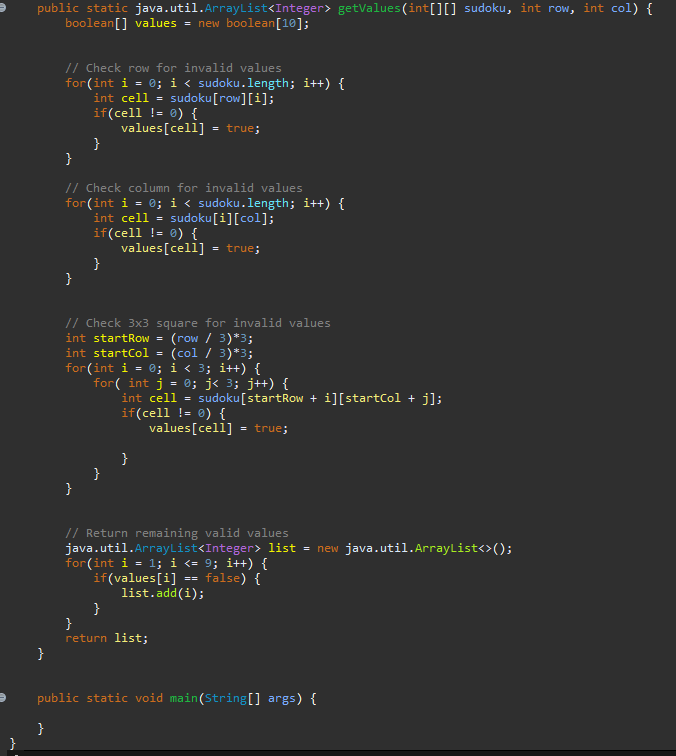

The Sudoku Solver is a Java application designed to solve any Sudoku puzzle using a backtracking algorithm. It fills the empty cells of a 9x9 grid while adhering to Sudoku rules, ensuring that each number appears only once in each row, column, and 3x3 subgrid. This project was developed as part of the ICS 211 course, aimed at improving problem-solving abilities and honing skills in algorithm design.

